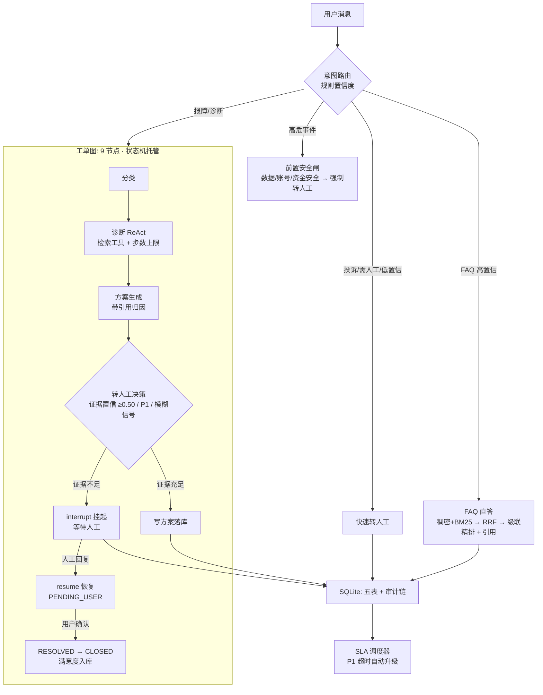

# 企业客服多 Agent 工单系统（Ticket Agent）

> 一条用户消息进来：是**简单问题**就 FAQ 直答（不进图，<1s）；是**报障**就拆成工单，走「分类 → 诊断 → 方案 → 用户确认 / 转人工」的 LangGraph 流水线；是**高危事件**（数据丢失 / 账号资金安全）就在入口拦下强制转人工（绝不让 FAQ 直答吞掉事故；人工回复后 resume 恢复）。全程由**工单状态机**托管生命周期，SLA 超时自动升级，满意度评价回流数据库。

| 项 | 内容 |
|---|---|
| 技术栈 | LangGraph + LangChain + FastAPI + Qdrant（本地）+ SQLite（业务库 + Checkpoint）+ OpenAI 兼容 LLM（**云端 / 离线规则双模式**）+ Vue 3 工作台（自研设计系统，零 UI 组件库）+ Docker（三阶段 / 非 root）+ GitHub Actions CI |
| 定位 | **真实业务流程**：工单状态机 + 规则/Agent 混合决策 + 人工接管闭环（HITL）+ SLA 运营指标 + 三层评估体系；**最小生产形态**：鉴权与租户隔离 + 容器化交付 |
| 代码规模 | src 布局，**108 项 pytest 全绿**；`prod` 逻辑零 LLM 依赖（规则确定性，可审计）|
| 界面 | 浏览器工作台（5 视图：在线客服 / 待办队列 / 工单列表 / 状态机 / 运营看板），FastAPI 同端口托管；旧的单文件演示页保留在 `/static/demo.html` |
| 评测 | **99 条**人工标注 gold set（含 4 条知识库外负例），mock / snapshot / live 三模式，**live 全项验收通过**（见下）|

---

## 架构



**设计主线**（面试口径）：

- **简单问题不该用 Agent**：FAQ 直答走 `classify_intent → answer_faq`，不进图——把 Agent 成本留给真正需要多步推理的问题。
- **状态真值永远在数据库**：图节点只做计算，状态迁移走 `states.py` 合法迁移表，非法迁移（如 `CLOSED → RESOLVED`）一律 422 拒绝并记录审计。
- **该转不转是事故**：转人工 = 事件；P1（资金/账号/数据安全）、证据不足（检索置信 < 0.50）、用户表达模糊（负责人/说不清楚）三条确定性规则，任一命中即 interrupt 挂起，绝不猜答案、绝不编造。
- **弱先验不放大行**：历史工单只是回复素材，不能撑起「证据充足」——转人工判定只看**当轮检索证据**。
- **副作用落库与中断节点分离**：`interrupt()` 节点 resume 会重放，副作用（状态/审计）全部前置到独立节点，重放零副作用。
- **身份从凭据来，不从请求体来**：`human-reply` 的坐席身份取自 `X-API-Key`，请求体里的 `actor` 一律忽略 —— 否则任何人都能冒充人工给用户回消息。
- **每个请求先归租户**：`tenant_id` 贯穿工单/客户/审计，跨租户访问一律 404（不泄露「这单存在」）；同名客户在不同租户是两条记录。
- **评测可复现**：mock / snapshot / live 三模式，snapshot 重放 live 快照，数字完全一致。
- **不是所有改动都值得写进简历**：混合检索（BM25）实测**没有增量**，代码留着兜底、简历里不夸大成提升项（见「检索升级」一节）。
- **前端不复制业务规则**：状态机迁移表、SLA 时限与阈值、枚举全部来自 `/api/v1/meta`（后端 `states.TRANSITIONS` / `sla.DEADLINES` 派生），界面只决定「哪个值配哪种颜色」。

---

## 状态机（非法迁移 100% 拒绝）

| 当前状态 | 合法目标 |
|---|---|
| new | in_triage / escalated / rejected |
| in_triage | processing / pending_user / escalated / rejected |
| processing | pending_user / resolved / escalated |
| pending_user | processing / resolved / escalated |
| resolved | closed / processing |
| escalated | pending_user / processing / resolved |
| closed / rejected | 终态（无出口）|

```text
new → in_triage → processing ─→ resolved → closed
        │    │            │        │
        │    │            └→ escalated ─→ pending_user ─→ resolved ─→ closed
        │    └→ escalated ← SLA 超时升级 / 人工接管路径
        └→ rejected（前置误判拒绝）
```

---

## 评测结果（live 模式 · 99 条人工标注 gold set）

| 指标 | 结果 | 验收线 |
|---|---|---|
| 意图准确率 | **100.0%** (30/30) | ≥90% ✅ |
| FAQ 解决率 | **100.0%** (40/40) | ≥85% ✅ |
| **负例拦截率**（知识库外诉求不硬答）| **100.0%** (4/4) | 100% ✅ |
| 引用命中率（直答类）| **100.0%** (40/40) | 100% ✅ |
| 转人工 F1 | **1.0000**（TP 9 / FP 0 / FN 0）| ≥0.85 ✅ |
| 诊断分类 / 定级 | 100% / 100% | — |
| 方案质量（规则版 judge）| 25/25 | — |
| 延迟（含级联精排）| FAQ P50 **56ms** / 诊断 P50 254ms | 端到端 < 1s / < 15s ✅ |
| 成本 | 0 token（规则版）| — |

**三模式**：`mock` 只验证逻辑链路（CI 无外部依赖）· `live` 真实 Qdrant 检索 · `snapshot` 重放 live 快照，**与 live 完全一致**。评测还抓到了 4 处真实缺陷并已修复（词表子串盲区、P1 口语词缺失、历史工单弱证据放行「数据丢失」、checkpoint 跨轮撞车）——详见 `docs/项目计划书.md` §M3 与 `eval/run_eval.py`。**M3 之后又抓到两个只有真入口才暴露的缺陷**：① 高危事件（「照片被弄丢了」）在 `/chat` 入口被 FAQ 直答吞掉（评测直接调图所以看不见）→ 已加前置安全闸 `biz/safety.py`；② 老库 `customers.name` 的 `UNIQUE` 在多租户下直接 500 → 已加表重建迁移（`db/models.py`）。两条都有回归用例。

> **诚实边界**：LLM-as-judge 未实施（无 key），方案质量/引用归因为规则版近似，人工校准并入 gold 标注（「谁标注谁负责」）；成本=0 仅对规则版成立；引用命中率只覆盖「直答且带引用」条目。语料与评测集 100% 自造，无第三方版权文档。

---

## 检索升级（P0-2）：逐项开关，让每一步自己证明有没有用

升级前只有一路稠密检索、只索引 `question` —— 语料里已经写好的口语变体（`aliases`）白存着。逐项打开、逐组重跑（99 条 live，**每组都重建索引**）：

| 组 | 配置 | FAQ 解决率 | 负例拦截率 | 引用命中 | FAQ P50 |
|---|---|---|---|---|---|
| G1 | 基线（question 索引 · 无混合 · 无精排）| 0.975 | 0.750 | 0.975 | 56.7ms |
| G2 | + aliases 进索引 | 1.000 | 0.750 | 1.000 | 59.0ms |
| G3 | + 混合检索（字符 bigram BM25）| 1.000 | 0.750 | 1.000 | 60.5ms |
| G4 | + 精排（对比文本含 answer 全文）| 0.700 | 1.000 | 0.800 | 1069.6ms |
| **G4a** | 精排（对比文本 = question+aliases）| **1.000** | **1.000** | **1.000** | 529.6ms |
| **G5b** | + 级联闸门（top1 余弦 ≥0.60 跳过精排）| **1.000** | **1.000** | **1.000** | **56.1ms** |

**三个结论，一个比一个反直觉**：

1. **关键词检索单独看没有增量**：G2→G3 指标完全一样 —— 稠密召回的 20 条候选已经覆盖 80 条语料，评测里也没有术语/编号类查询。**代码留着为这类查询兜底，不写进简历当成绩**。
2. **精排塞错文本会负优化**：把 answer 全文放进对比文本，FAQ 解决率从 1.000 掉到 0.700（−30pp）—— 精排比的是「问题像不像问题」，答案全文只会稀释匹配。
3. **级联闸门把精排的延迟代价抹平**：稠密 top1 够准时直接跳过精排，P50 从 529ms 回到 **56ms**，指标不降。

阈值不手拍：`scripts/tune_threshold.py` 从评测记录扫可行区间（实测 **[0.49, 0.62]**，正例零漏放、负例零误放），`CONF_HINT` 取区间中点 **0.55**。

> **为什么不用 fastembed 的 `Qdrant/bm25`**：实测该模型对中文只产出 1 个非零 token（`SimpleTokenizer` + 无中文词干），接上等于「看着是混合、实际只有稠密在干活」→ `rag/bm25.py` 自实现字符 bigram BM25（零新依赖）。

**负例：量化「不该答的时候会不会答」**：gold set 80 → **99 条**，新增 4 条知识库外负例（赔付/议价/线下/竞品比较）与 `faq_neg_blocked` 指标；基线只拦下 3/4，升级后 4/4 —— 这正是「证据强度改取最终候选前 3 条的最大稠密余弦」带来的（**排序换算法，判据不换**）。

---

## 鉴权与租户（P0-3）：最小但真实

| 端点 | 鉴权 | 说明 |
|---|---|---|
| 用户侧（`/chat`、`/ack`、工单详情）| 不强制 | 终端用户不会有坐席凭据；带 key 用 key 的租户，不带 key = 默认租户的匿名访客（因此看不到具名租户的数据）|
| 坐席写（`/tickets/{id}/human-reply`）| **必须** `X-API-Key`（角色 agent）| 无 key 401 / 错 key 401 / viewer 403 |
| 坐席读（`/admin/escalations`）| 同上（agent 或 viewer）| 队列按租户过滤 |

实测（真实 HTTP，`REQUIRE_AUTH=true`）：

```text
chat_no_key=200                                             # 用户入口不强制鉴权
human_reply_no_key=401      human_reply_bad_key=401         human_reply_viewer_role=403
human_reply_cross_tenant=404     ticket_detail_cross_tenant=404     admin_queue_no_key=401
# body 里谎称 actor=root → 审计落库为 {'to': 'pending_user', 'actor': '坐席甲', 'reason': '人工已回复，等待用户确认'}
```

- key 配置 `API_KEYS=key:租户:坐席名[:角色]`，审计里只留 key 前 6 位指纹，不落全量凭据；
- 未启用鉴权时启动打 WARNING、身份记 `local-agent` —— 不假装安全，也不让 CI 依赖仓库密钥；
- **迁移**：老库没有 `tenant_id`（幂等补列）、`customers.name` 上有旧 `UNIQUE`（重建表放宽为 `(tenant_id, name)`）—— 两条迁移都在 `create_all` 之后执行，`init_db()` 与测试 `configure()` **共用同一段**（否则测试绿、真库起不来）。

---

## 浏览器工作台（M5）

原来只有 `static/demo.html`（M4 的单文件演示页，**保留不变**）。现在多了正式的**客服工单工作台**：Vue 3 + Vite，**零 UI 组件库**，首屏 **118 KB JS（gzip 45 KB）+ 13 KB CSS**。

| 视图 | 给谁看 | 看什么 |
|---|---|---|
| 在线客服 | 用户 | 对话 + 意图/置信度可见 + SSE 诊断轨迹 + 工单卡 + 满意度评价 |
| 待办队列 | 坐席 | 转人工 / 超时升级的工单，按死限升序 + 剩余时间条 + 已等待时长 |
| 工单列表 | 坐席 | 按状态 / 优先级 / 排序筛选，点开进详情（消息流 + 状态迁移审计时间线）|
| 状态机 | 所有人 | 8 态 + 合法迁移（**从 `/api/v1/meta` 渲染，不是画上去的**）+ 当前分布 |
| 运营看板 | 运营 | 状态 / 优先级 / 品类分布 + SLA 分桶 + 满意度分布 |

三条设计纪律：

- **前端不复制业务规则**：状态机迁移表、SLA 时限与临近阈值、置信度阈值、全部枚举都由 `/api/v1/meta` 提供；
  规则改一处、界面跟着改，不存在「文档说得对、界面做另一套」。
- **状态真值不在前端**：每次操作后回查服务端，不做乐观更新 —— 在一个「非法迁移会被 422 拒绝」的系统里，
  乐观更新会直接骗人。
- **界面语义不比 API 更宽松**：不用 `StaticFiles(html=True)`（它把任意未匹配路径都渲染成 index.html，吞掉 404 语义）；
  产物缺失时返回**构建指引页（200）**而非 500 —— 让「没构建前端」与「服务坏了」可区分。
  坐席凭据只进 `sessionStorage`，关标签页即失效。

顺带修掉两个后端真问题 —— 都属于「只有把界面做出来才会暴露」的那一类：

- **快速转人工的工单没有 SLA 死限**：死限原先只在图内受理节点写，而投诉 / 低置信 / 高危事件走 `_escalate_fast`（不经过图）
  → 这些单 `sla_deadline` 永远为 NULL，被 `scan_sla` 的 `if t.sla_deadline is None: continue` 跳过 ——
  **最该被 SLA 兜住的单，反而永远不会超时升级**。现在建单即计时（`create_ticket` 写死限）。
- **escalated 被判成「不参与 SLA 计时」**：于是看板显示「没有超时」，而队列里 3 张超时单正红着。
  现在 escalated 算超时，另用 `auto_upgrade_pending` 表示「调度器下一趟会真的动它们」的数量。

零 UI 依赖的代价只是一个内联 SVG 图标文件（40 个图标）。自动化只到 **SSR 烟测**（6 个场景渲染成字符串）——
**它兜白屏级错误，不代替人工验收**：布局、动效、真实数据下的观感必须人打开看。

---

## Docker 与 CI（P0-1）

- **三阶段构建**（`frontend`(node) → `builder`(uv) → `runtime`）：运行镜像里**没有 Node、没有 npm、没有前端源码**，只有打包好的 `frontend/dist`；构建工具不进产线镜像；非 root（uid 10001）+ `HEALTHCHECK` 用标准库 `urllib` 探 `/health/live`；
- 镜像 **690 MB**（`ticket-agent:0.2.0`，前端产物仅 0.13 MB）；**不预置 embedding 模型**（起服务不需要，留给部署时挂载 HF 缓存，避免镜像静默膨胀几百 MB）；
- CI 三 job：`test`（108 用例 + mock 评测 99 条，**零密钥确定性**）+ `frontend`（npm ci → 构建 → 产物校验 → SSR 烟测）+ `docker`（每次真构建镜像并冒烟：live 探针 / 寒暄链路 / **工作台壳页** / 镜像内无 Node / 非 root 校验）。

```bash
# 国内网络可加：--build-arg NPM_REGISTRY=https://registry.npmmirror.com
docker build -t ticket-agent:0.2.0 .
docker run --rm -p 8000:8000 ticket-agent:0.2.0     # 工作台在 http://127.0.0.1:8000/
```

---

## 快速开始（约 10 分钟）

前置：Python 3.13 + [uv](https://docs.astral.sh/uv/)。Qdrant 用**本地嵌入式模式**（零容器）。

```bash
git clone <repo-url> && cd project03
uv sync --python 3.13

# 1) 建 FAQ 向量索引（离线 embedding 模型自动缓存到 ~/.cache/p408qa）
python scripts/init_index.py

# 2) 一键演示：FAQ 直答 / 报障建单·诊断 / P1 转人工→resume / 满意度闭环 / SLA 升级
python scripts/demo_cli.py

# 3) 评测（可选）：mock 秒级自检；live 出真数；snapshot 复现
python eval/run_eval.py --mode mock
python eval/run_eval.py --mode live
python eval/run_eval.py --mode snapshot

# 4) 测试
python -m pytest -q        # 108 passed

# 5) 构建工作台（可选：不构建也能用全部 API，根路径会返回构建指引页）
cd frontend && npm install --include=dev && npm run build && cd ..

# 6) 启动服务：工作台 http://127.0.0.1:8000/ · 旧演示页 /static/demo.html · /docs
uv run uvicorn project03.api.main:app --port 8000
```

> 离线环境提示：`export HF_HOME=~/.cache/p408qa HF_HUB_OFFLINE=1` 可跳过模型在线下载（本项目已缓存 bge-small-zh-v1.5）。

### API 一览

| 端点 | 说明 |
|---|---|
| `POST /api/v1/chat` | 主入口：意图 → FAQ 直答 / 工单图 / 转人工 |
| `GET /api/v1/chat/stream` | SSE 流式（诊断过程逐节点推送）|
| `GET /api/v1/tickets/{id}` | 工单详情 + 审计链 |
| `POST /api/v1/tickets/{id}/human-reply` | 人工接管：resume 恢复挂起图 / 快速路径；终态 422 |
| `POST /api/v1/tickets/{id}/ack?rating=5` | 用户确认解决（RESOLVED→CLOSED）+ 满意度入库 |
| `GET /api/v1/admin/escalations` | 管理面升级队列（按 SLA 死限升序）|
| `GET /api/v1/meta` | **业务元数据**：状态机迁移表 / SLA 时限与阈值 / 枚举（工作台的规则来源，无鉴权）|
| `GET /api/v1/tickets` | 坐席工单列表（`state` / `priority` / `order` / `limit` 筛选；非法状态 400）|
| `GET /api/v1/admin/me` | 身份回显（tenant / actor / role / key 指纹）——前端据此收敛可操作项 |
| `GET /api/v1/admin/overview` | 运营聚合：状态·优先级·品类分布 / SLA 分桶 / 满意度 / 待办队列 |
| `GET /api/v1/health/live` / `ready` | 存活探针 / 就绪探针（DB + Qdrant）|
| `GET /` · `/assets/{path}` · `/favicon.svg` | 工作台壳页 / 前端产物 / 图标（产物缺失时 `/` 返回构建指引页 200）|

> 坐席端点（`human-reply` / `admin/*` / 工单列表）在 `REQUIRE_AUTH=true` 时要求 `X-API-Key`；用户侧端点（`/chat`、`/ack`、工单详情）与 `/meta` 不强制 —— 见「鉴权与租户」。

---

## 项目结构

```text
project03/
├── pyproject.toml / uv.lock / .env.example / README.md
├── src/project03/
│   ├── biz/            # 规则层：intent / FAQ / 状态机 / 工单 / 转人工 / SLA / safety 前置闸
│   ├── db/             # SQLite 五表 + 轻量迁移（补租户列 / 放宽唯一约束）+ 种子
│   ├── rag/            # 检索：dense + 字符 bigram BM25 → RRF → 级联 Cross-Encoder 精排
│   ├── gql/            # LangGraph 工单图（9 节点 + interrupt/resume）
│   └── api/            # FastAPI + auth（坐席鉴权 / 租户解析）+ workbench（元数据与运营读端点）
├── scripts/            # init_index 建索引 / demo_cli 演示 / tune_threshold 阈值校准
├── eval/               # gold_set（99 条）/ run_eval（三模式）/ judge（规则版）
├── static/demo.html    # 旧的单文件演示页（M4，保留）
├── frontend/           # 工作台（Vue 3 + Vite，零 UI 组件库）
│   ├── src/            # store / api / meta（业务规则只从 /api/v1/meta 读）+ 15 个组件
│   └── scripts/        # ssr-build + ssr-smoke（SSR 烟测，进 CI）
├── Dockerfile / .github/workflows/ci.yml
└── tests/              # 108 用例：状态机 / 意图 / FAQ / API / 图 / SLA / 评测 / 鉴权 / 安全闸 / 工作台端点 / 前端托管契约
```

---

## 免责声明

- 本项目为**学习研究用途**，语料（80 条 FAQ）与评测集（99 条标注）全部自造，不包含任何第三方版权文档，不代表任何真实产品的行为。
- 鉴权是**最小实现**：API Key 绑定租户，够撑起「身份可追溯 + 租户隔离 + 越权 401/403/404」；不含密钥轮转、细粒度 RBAC、用户登录态与会话管理。
- 规则版系统**不构成生产客服意见**；接入真实业务前需补充合法合规与安全评估。
- 涉及 OpenAI 兼容 LLM 的配置仅为预留双模式，当前执行路径不发起任何 LLM 请求（成本 0 token）。

---

## 里程碑

M0 环境与数据 ✅ → M1 MVP（意图路由 + FAQ + 工单雏形）✅ → M2 完整版（图诊断 + 转人工 + SLA + 演示页）✅ → M3 评估体系 ✅ → M4 工程化与面试弹药 ✅ → **P0-1 容器化 + CI ✅** → **P0-2 检索升级（aliases / 混合检索 / 级联精排 / 阈值校准）✅** → **P0-3 最小鉴权 + 租户 + 高危前置闸 ✅** → **M5 浏览器工作台（5 视图 + SSR 烟测 + 三阶段镜像）✅**

详细设计见 [docs/项目计划书.md](docs/项目计划书.md)。