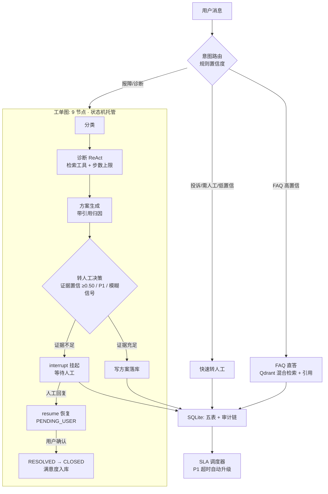

# 企业客服多 Agent 工单系统（Ticket Agent）

> 一条用户消息进来：是**简单问题**就 FAQ 直答（不进图，<1s）；是**报障**就拆成工单，走「分类 → 诊断 → 方案 → 用户确认 / 转人工」的 LangGraph 流水线；是**紧急事件**就强制转人工（interrupt 挂起，人工回复后 resume 恢复）。全程由**工单状态机**托管生命周期，SLA 超时自动升级，满意度评价回流数据库。

| 项 | 内容 |
|---|---|
| 技术栈 | LangGraph + LangChain + FastAPI + Qdrant（本地）+ SQLite（业务库 + Checkpoint）+ OpenAI 兼容 LLM（**云端 / 离线规则双模式**）|
| 定位 | **真实业务流程**：工单状态机 + 规则/Agent 混合决策 + 人工接管闭环（HITL）+ SLA 运营指标 + 三层评估体系 |
| 代码规模 | src 布局，53 项 pytest 全绿；`prod` 逻辑零 LLM 依赖（规则确定性，可审计）|
| 评测 | 80 条人工标注 gold set，mock / snapshot / live 三模式，**live 四项验收全过**（见下）|

---

## 架构



**设计主线**（面试口径）：

- **简单问题不该用 Agent**：FAQ 直答走 `classify_intent → answer_faq`，不进图——把 Agent 成本留给真正需要多步推理的问题。
- **状态真值永远在数据库**：图节点只做计算，状态迁移走 `states.py` 合法迁移表，非法迁移（如 `CLOSED → RESOLVED`）一律 422 拒绝并记录审计。
- **该转不转是事故**：转人工 = 事件；P1（资金/账号/数据安全）、证据不足（检索置信 < 0.50）、用户表达模糊（负责人/说不清楚）三条确定性规则，任一命中即 interrupt 挂起，绝不猜答案、绝不编造。
- **弱先验不放大行**：历史工单只是回复素材，不能撑起「证据充足」——转人工判定只看**当轮检索证据**。
- **副作用落库与中断节点分离**：`interrupt()` 节点 resume 会重放，副作用（状态/审计）全部前置到独立节点，重放零副作用。
- **评测可复现**：mock / snapshot / live 三模式，snapshot 重放 live 快照，数字完全一致。

---

## 状态机（非法迁移 100% 拒绝）

| 当前状态 | 合法目标 |
|---|---|
| new | in_triage / escalated / rejected |
| in_triage | processing / pending_user / escalated / rejected |
| processing | pending_user / resolved / escalated |
| pending_user | processing / resolved / escalated |
| resolved | closed / processing |
| escalated | pending_user / processing / resolved |
| closed / rejected | 终态（无出口）|

```text
new → in_triage → processing ─→ resolved → closed
        │    │            │        │
        │    │            └→ escalated ─→ pending_user ─→ resolved ─→ closed
        │    └→ escalated ← SLA 超时升级 / 人工接管路径
        └→ rejected（前置误判拒绝）
```

---

## 评测结果（M3 · live 模式 · 80 条人工标注 gold set）

| 指标 | 结果 | 验收线 |
|---|---|---|
| 意图准确率 | **100.0%** (30/30) | ≥90% ✅ |
| FAQ 解决率 | **100.0%** (25/25) | ≥85% ✅ |
| 引用命中率（直答类）| **100.0%** (25/25) | 100% ✅ |
| 转人工 F1 | **1.0000**（TP 9 / FP 0 / FN 0）| ≥0.85 ✅ |
| 诊断分类 / 定级 | 100% / 100% | — |
| 方案质量（规则版 judge）| 25/25 | — |
| 延迟 | FAQ P50 55ms / 诊断 P50 173ms | 端到端 < 1s / < 15s ✅ |
| 成本 | 0 token（规则版）| — |

**三模式**：`mock` 只验证逻辑链路（CI 无外部依赖）· `live` 真实 Qdrant 检索 · `snapshot` 重放 live 快照，**与 live 完全一致**。评测还抓到了 4 处真实缺陷并已修复（词表子串盲区、P1 口语词缺失、历史工单弱证据放行「数据丢失」、checkpoint 跨轮撞车）——详见 `docs/项目计划书.md` §M3 与 `eval/run_eval.py`。

> **诚实边界**：LLM-as-judge 未实施（无 key），方案质量/引用归因为规则版近似，人工校准并入 gold 标注（「谁标注谁负责」）；成本=0 仅对规则版成立；引用命中率只覆盖「直答且带引用」条目。语料与评测集 100% 自造，无第三方版权文档。

---

## 快速开始（约 10 分钟）

前置：Python 3.13 + [uv](https://docs.astral.sh/uv/)。Qdrant 用**本地嵌入式模式**（零容器）。

```bash
git clone <repo-url> && cd project03
uv sync --python 3.13

# 1) 建 FAQ 向量索引（离线 embedding 模型自动缓存到 ~/.cache/p408qa）
python scripts/init_index.py

# 2) 一键演示：FAQ 直答 / 报障建单·诊断 / P1 转人工→resume / 满意度闭环 / SLA 升级
python scripts/demo_cli.py

# 3) 评测（可选）：mock 秒级自检；live 出真数；snapshot 复现
python eval/run_eval.py --mode mock
python eval/run_eval.py --mode live
python eval/run_eval.py --mode snapshot

# 4) 测试
python -m pytest -q        # 53 passed

# 5) 启动 API + 演示页（http://127.0.0.1:8000/static/demo.html）
uv run uvicorn project03.api.main:app --port 8000
```

> 离线环境提示：`export HF_HOME=~/.cache/p408qa HF_HUB_OFFLINE=1` 可跳过模型在线下载（本项目已缓存 bge-small-zh-v1.5）。

### API 一览

| 端点 | 说明 |
|---|---|
| `POST /api/v1/chat` | 主入口：意图 → FAQ 直答 / 工单图 / 转人工 |
| `GET /api/v1/chat/stream` | SSE 流式（诊断过程逐节点推送）|
| `GET /api/v1/tickets/{id}` | 工单详情 + 审计链 |
| `POST /api/v1/tickets/{id}/human-reply` | 人工接管：resume 恢复挂起图 / 快速路径；终态 422 |
| `POST /api/v1/tickets/{id}/ack?rating=5` | 用户确认解决（RESOLVED→CLOSED）+ 满意度入库 |
| `GET /api/v1/admin/escalations` | 管理面升级队列（按 SLA 死限升序）|
| `GET /api/v1/health/live` / `ready` | 存活探针 / 就绪探针（DB + Qdrant）|

---

## 项目结构

```text
project03/
├── pyproject.toml / uv.lock / .env.example / README.md
├── src/project03/
│   ├── biz/            # 规则层：intent 路由 / FAQ 检索 / 状态机 / 工单 / 转人工 / SLA
│   ├── db/             # SQLite 五表 + 种子（业务库与 checkpoint 按库隔离）
│   ├── rag/            # Qdrant 检索（bge-small-zh-v1.5 dense + 产品线过滤）
│   ├── gql/            # LangGraph 工单图（9 节点 + interrupt/resume）
│   └── api/            # FastAPI（chat/stream/tickets/human-reply/ack/escalations/health）
├── scripts/            # init_index 建索引 / demo_cli 一键演示 / demo_chat 会话演示
├── eval/               # gold_set（80 条）/ run_eval（三模式）/ judge（规则版）
├── static/demo.html    # 浏览器演示页（SSE 流式 + 工单状态可视化 + 人工接管模拟）
└── tests/              # 53 用例：状态机 / 意图 / FAQ / API / 图 / SLA / 评测
```

---

## 免责声明

- 本项目为**学习研究用途**，语料（80 条 FAQ）与评测集（80 条标注）全部自造，不包含任何第三方版权文档，不代表任何真实产品的行为。
- 规则版系统**不构成生产客服意见**；接入真实业务前需补充合法合规与安全评估。
- 涉及 OpenAI 兼容 LLM 的配置仅为预留双模式，当前执行路径不发起任何 LLM 请求（成本 0 token）。

---

## 里程碑

M0 环境与数据 ✅ → M1 MVP（意图路由 + FAQ + 工单雏形）✅ → M2 完整版（图诊断 + 转人工 + SLA + 演示页）✅ → M3 评估体系 ✅ → M4 工程化与面试弹药 ✅

详细设计见 [docs/项目计划书.md](docs/项目计划书.md)。